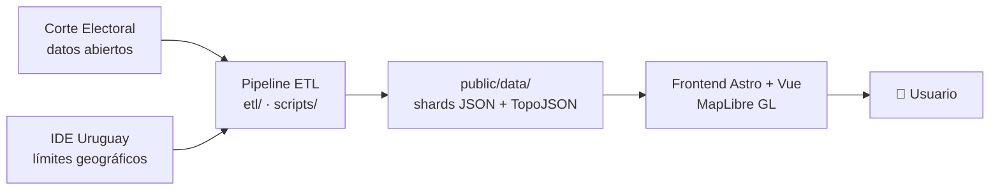

# 🇺🇾 Mapa Electoral de Uruguay

Visualización interactiva de los resultados electorales de Uruguay: **19 departamentos + vista nacional**, **14 instancias electorales entre 2014 y 2025**, con drill-down geográfico hasta el circuito y el local de votación, y desglose **lista por lista (hoja)**.

**🔗 App en vivo:** https://uruguay-electoral-map.vercel.app

> Los datos electorales uruguayos son públicos, pero viven en planillas que casi nadie abre. Este proyecto los vuelve explorables en un mapa: buscás tu barrio o tu serie, elegís una elección y ves quién ganó y con cuántos votos, hasta el nivel de cada lista.

---

## ✨ Qué se puede hacer

- **Recorrer los 19 departamentos** y una **vista nacional** consolidada de todo el país.
- **Comparar 14 elecciones (2014–2025):** internas, nacionales, balotajes, departamentales, los plebiscitos (Vivir sin Miedo, allanamientos, seguridad social) y el referéndum de la LUC.
- **Hacer drill-down geográfico:** departamento → barrio/zona (Montevideo) o serie/localidad (interior) → circuito → local de votación.
- **Ver el voto por hoja** (cada lista), no solo el agregado por partido o lema.
- **Tabla de datos accesible** (a11y) por cada nivel geográfico, navegable por teclado y lectores de pantalla.

## 🗺️ Cobertura

| Dimensión | Detalle |
|-----------|---------|
| **Geografía** | 19 departamentos + vista nacional (`_nacional`) |
| **Niveles (Montevideo)** | zona/barrio · circuito · local |
| **Niveles (interior)** | serie · localidad · circuito · local |
| **Granularidad mínima** | hoja (lista) por unidad geográfica |

**Elecciones incluidas:** Nacionales 2014 · Balotaje 2014 · Internas 2019 · Nacionales 2019 · Plebiscito *Vivir sin Miedo* 2019 · Balotaje 2019 · Departamentales 2020 · Referéndum LUC 2022 · Internas 2024 · Nacionales 2024 · Plebiscito allanamientos 2024 · Plebiscito seguridad social 2024 · Balotaje 2024 · Departamentales 2025.

## 🧱 Stack

| Capa | Tecnología |
|------|------------|
| Framework / build | [Astro 5](https://astro.build) (islas) |
| UI interactiva | [Vue 3.5](https://vuejs.org) (Composition API) |
| Mapas | [MapLibre GL 5](https://maplibre.org) |
| Geometría | TopoJSON · d3-geo · polygon-clipping |
| Estado | [nanostores](https://github.com/nanostores/nanostores) (`@nanostores/vue`) |
| Estilos | [Tailwind CSS 4](https://tailwindcss.com) |
| ETL | TypeScript (esbuild / tsx) + Python (geometría y casos especiales) |
| Deploy | [Vercel](https://vercel.com) (`@astrojs/vercel`) |

## 🏗️ Arquitectura de datos

El producto separa con claridad **ingesta de datos** (offline, reproducible) de **render** (estático, servido como JSON):



- El **ETL** descarga, normaliza (UTF-8), agrega por nivel geográfico y emite *shards* JSON pequeños bajo `public/data/`.
- El **frontend** es estático: carga solo los shards de la elección y el departamento que el usuario está mirando.
- **Quality gates** en el build fallan si los datos no cierran (cobertura geográfica, reconciliación de totales, tamaño de geometría, performance, accesibilidad).

## 📁 Estructura del repositorio

```
.
├── src/            # Frontend Astro + Vue (ver src/README.md)
├── etl/            # Pipeline de datos en TypeScript (ver etl/README.md)
├── scripts/        # Builders Python + gates de build (ver scripts/README.md)
├── public/
│   └── data/       # Datos servidos: shards JSON + TopoJSON (ver public/data/README.md)
├── astro.config.mjs
├── vercel.ts       # Config de deploy en Vercel
└── package.json
```

## 🚀 Quick start

Requisitos: **Node ≥ 20** y **Python 3** (solo para regenerar datos con los scripts Python).

```bash
npm install        # instalar dependencias
npm run dev        # servidor de desarrollo (Astro)
npm run build      # build de producción (corre gates + genera OG e índice de búsqueda)
npm run preview    # previsualizar el build
npm run check      # type-check de Astro/Vue/TS
```

## 🔄 Regenerar datos (ETL)

Cada instancia electoral tiene su propio runner. Ejemplos:

```bash
npm run etl:montevideo               # ETL de Montevideo (por barrio)
npm run etl:nacionales-2024-mvd      # nacionales 2024, Montevideo
npm run etl:nacional                 # consolida la vista nacional (geo + votos)
npm run etl:vivir-sin-miedo          # plebiscito 2019 (extraído de PDF oficial)
```

Ver **[`etl/README.md`](etl/README.md)** para el catálogo completo de runners y el modelo de pipeline.

## ✅ Quality gates

```bash
npm run gate:data        # integridad de shards de datos
npm run gate:escaleras   # consistencia de escaleras de color
npm run gate:grises      # auditoría de zonas sin geometría (Python)
npm run gate:all         # performance + accesibilidad + Core Web Vitals
```

## 📊 Modelo de datos y dominio

El modelo es **agnóstico al tipo de elección** y respeta las invariantes del sistema electoral uruguayo (voto canónico por etapa de escrutinio, opción×geografía como unidad base, blancos/anulados como categorías aparte, etc.). El contrato de datos completo está documentado en **[`public/data/README.md`](public/data/README.md)**.

En Montevideo los votos se ubican en el mapa por **circuito → barrio** (geolocalización: dirección → coordenada → *point-in-polygon*), con un mapeo **por ciclo electoral** porque los números de circuito se reasignan entre elecciones. La decisión de diseño está en **[`docs/adr/0001-circuito-barrio-por-ciclo.md`](docs/adr/0001-circuito-barrio-por-ciclo.md)**.

## 📚 Fuentes de datos y atribución

- **Datos electorales:** [Corte Electoral de Uruguay](https://www.corteelectoral.gub.uy/) — [Catálogo de Datos Abiertos](https://catalogodatos.gub.uy/).
- **Datos geográficos:** [IDE Uruguay](https://www.gub.uy/infraestructura-datos-espaciales/) — límites departamentales y geometrías.
- El Sí/No del **plebiscito *Vivir sin Miedo* (2019)** no está en los datos abiertos; se extrajo de un PDF oficial circuito por circuito y se validó contra el total nacional.

Este es un proyecto independiente, sin afiliación oficial con la Corte Electoral ni con organismos del Estado.

## 📄 Licencia

MIT.

## 👤 Autor

**Juan Pinto Selso** — [GitHub](https://github.com/Juanpintoselso33) · [LinkedIn](https://www.linkedin.com/in/juanpintoselso33)
