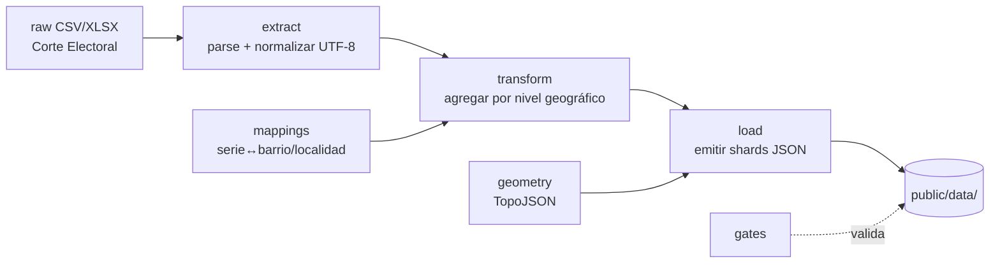

# etl/ — Pipeline de datos

Pipeline **Extract → Transform → Load** que convierte los datos abiertos de la Corte Electoral y la geografía de la IDE Uruguay en *shards* JSON pequeños y listos para servir bajo [`public/data/`](../public/data/README.md).

Está escrito en **TypeScript** y se ejecuta vía `esbuild` (bundle a CJS) o `tsx`, a través de los scripts `etl:*` de `package.json`.

## Modelo del pipeline



## Estructura

| Carpeta | Responsabilidad |
|---------|-----------------|
| `extract/` | Parseo de CSV y normalización de encoding. |
| `transform/` | Agregaciones por serie, localidad, circuito, barrio y hoja; lógica agnóstica al tipo de elección (`aggregate-*.ts`). |
| `load/` | Emisión de los shards JSON finales (`emit-shard.ts`). |
| `geometry/` | Construcción y simplificación de TopoJSON; join circuito↔barrio. |
| `mappings/` | Tablas de mapeo geográfico (serie → barrio / localidad), curadas manualmente por capital. |
| `lib/` | Utilidades compartidas: normalización, mapeos serie-barrio / serie-localidad. |
| `gates/` | Validaciones que corren en build: cobertura de zonas, reconciliación de totales, tamaño de geometría. |
| `og/` | Generación de imágenes Open Graph. |
| `search-index/` | Generación del índice de búsqueda. |

## Patrón de runners

Cada instancia electoral tiene un runner dedicado (`etl/run-*.ts`) expuesto como script npm. Ejemplos:

```bash
npm run etl:montevideo                 # Montevideo por barrio
npm run etl:nacionales-2024-interior   # nacionales 2024, interior
npm run etl:nacional                   # consolida la vista nacional
npm run etl:vivir-sin-miedo            # plebiscito 2019 (desde PDF oficial)
```

Ver `package.json` (`scripts.etl:*`) para el catálogo completo (~50 runners).

## Invariantes que respeta

- **Voto canónico** contado de una sola etapa de escrutinio (la definitiva); nunca sumar a través de etapas.
- **Unidad base = opción electoral × unidad geográfica** (hoja en internas/legislativas; candidato/lema en balotaje/presidencial).
- **Blancos / anulados / observados** se modelan como categorías aparte (sin partido ni hoja).
- **Normalización a UTF-8** en la ingesta (el origen suele venir en Latin-1).

El contrato de dominio completo está en [`public/data/README.md`](../public/data/README.md).
